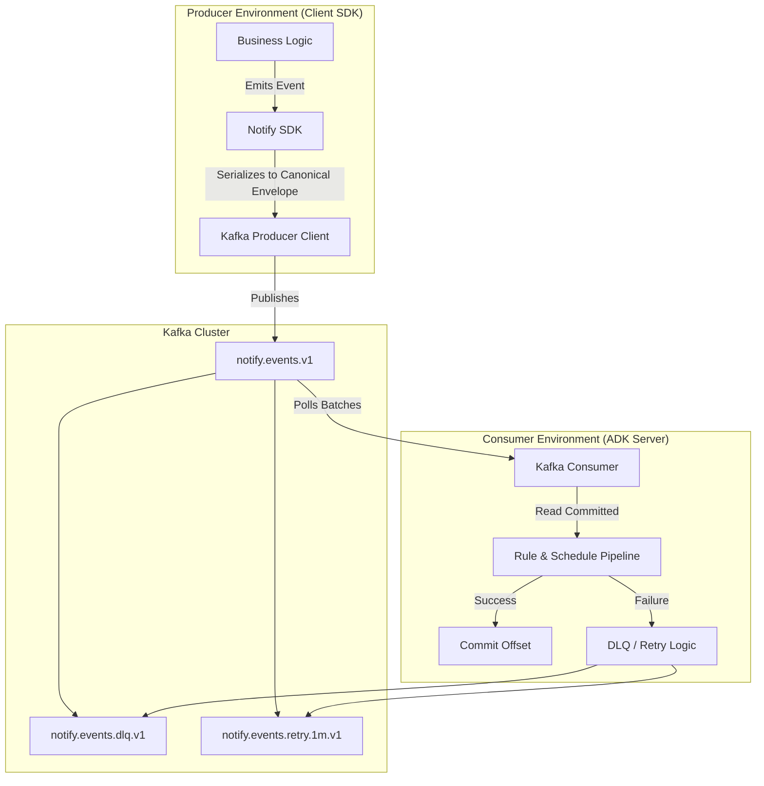
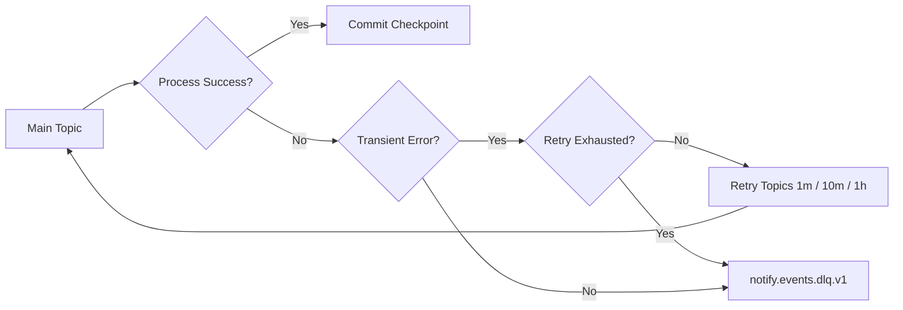

# Kafka Integration Guide

This document details the architecture, design, and operational behavior of the Kafka transport layer for Notify.ai. It covers how the **Client SDK** (the producer) interacts with the **ADK Server** (the consumer) to guarantee reliable, ordered, and multi-tenant event delivery.

## 1. Architecture Overview

At a high level, the system implements an asynchronous event pipeline where domain events generated by application source code are reliably transmitted to the Notify AI scheduling and routing framework.



### Goals
- **Multi-tenancy:** Secure isolation and fair use among different tenants.
- **Reliability:** At-least-once delivery with producer retries and consumer idempotency guarantees.
- **Ordering:** Strict ordering guarantees per designated entity/key.
- **Resilience:** Built-in mechanisms for transient failures via backoff retry channels and terminal exception handling via Dead Letter Queues (DLQs).

---

## 2. Canonical Event Envelope

To ensure deterministic routing, auditing, and replayability, all records adhere to a standardized event envelope format. The SDK encapsulates payloads before pushing them to Kafka.

```json
{
  "eventId": "uuid-v7",
  "tenantId": "tenant-123",
  "eventType": "ORDER_PLACED",
  "entityType": "ORDER",
  "entityId": "ORD-001",
  "occurredAt": "2026-04-18T12:00:00Z",
  "producer": {
    "sdkVersion": "1.0.0",
    "service": "checkout-service",
    "instance": "checkout-7d9d"
  },
  "trace": {
    "traceId": "t-123456789",
    "correlationId": "c-987654321"
  },
  "schemaVersion": 3,
  "payload": {
    "amount": 99.99,
    "currency": "USD"
  }
}
```

### Required Kafka Headers
We mandate several Kafka headers to allow the ADK Server consumer and streaming tools to filter and diagnose data without deserializing the extensive payload:

| Header Key        | Example / Description                              |
|-------------------|----------------------------------------------------|
| `tenant-id`       | Allows low-overhead tenant identification & routing|
| `event-id`        | Used for idempotency tracking                      |
| `event-type`      | E.g., `ORDER_PLACED`                               |
| `schema-version`  | Payload schema version                             |
| `trace-id`        | OpenTelemetry or downstream tracing ID             |
| `correlation-id`  | Log aggregation linkage                            |
| `content-type`    | `application/json` or `application/avro`           |

---

## 3. Multi-Tenancy Isolation Strategy

We employ a **Shared Topic, Tenant-Aware Keying** approach by default, enabling high utilization while preserving isolation requirements.

### Standard Model (Shared Topic)
- **Topic:** `notify.events.v1`
- **Key Strategy:** `tenantId:entityId` (or `tenantId:userId`)
- **Isolation Controls:**
  - **AuthN/Z:** Access limited via mTLS/SASL authentication and strict ACLs on namespaces.
  - **Quotas:** Per-tenant byte-rate and request-rate capping in Kafka to prevent noisy-neighbor issues.
  - **Routing:** Headers guarantee visibility isolation in the consumer tier.

### Premium Model (Dedicated Topics)
For heavily regulated tenants, an optional **dedicated topic** per tenant is used:
- **Topic format:** `notify.events.<tenantId>.v1`
- Same consumer business logic is utilized; topics are dynamically discovered from a central tenant registry.

---

## 4. Partition Assignment & Ordering Guarantee

Determining exactly *how* events map to partitions is critical for maintaining strict ordering.

### Producer Keying Strategies
We use key-based partition assignments. The standard key is formatted as `tenantId:orderingKey`. 

- **By User (`tenantId:userId`):** Ensures a singular timeline of events strictly ordered per user.
- **By Entity (`tenantId:entityId`):** Ensures lifecycle semantics (e.g., *Created* → *Updated* → *Closed*) happen in absolute order for a specific record.

> [!TIP]
> **Hot Partition Mitigation:** For highly skewed event domains that do not require strict ordering (like global clickstream logging), the SDK appends a synthetic shard token (`tenantId:userId:shard(0..N)`) to balance out ingest load over multiple partitions.

### Consumer Assignment
- **Group ID:** `adk-event-consumer-v1`
- **Strategy:** *Cooperative Sticky Assignor*. This largely avoids 'stop-the-world' event processing delays when new ADK server instances are horizontally scaled up or down.

---

## 5. Producer Configuration & Backpressure

To maximize durability, the Client SDK ships with resilient Kafka configurations.

### Baseline Properties
- `acks=all`: Wait for leader and all in-sync replicas to acknowledge the append.
- `enable.idempotence=true`: Prevents duplicate appends if retries fire during temporary network blips.
- `retries=Integer.MAX_VALUE`: Defer to `delivery.timeout.ms` rather than arbitrary retry counts.
- `max.in.flight.requests.per.connection=5`: The maximum safe limit ensuring idempotence constraint compliance.
- `delivery.timeout.ms=120000`: 2 minutes total to buffer and successfully write to the broker.
- `compression.type=zstd`: Highly recommended. Swap to Snappy only if producer CPU is artificially restricted.

### Backpressure Management
Inside the source application, events are funneled through a bounded in-memory async queue. If Kafka ingest degrades and the queue fills up, the default SDK behavior is `block` mode with a breaker threshold. 

---

## 6. Consumer Processing & Offset Management

> [!IMPORTANT]  
> **Rule of Thumb:** Offsets are committed *only* after processing succeeds.

To achieve **At-Least-Once Delivery**:
1. Disable `enable.auto.commit` on the consumer.
2. Read batches with `isolation.level=read_committed`.
3. Process grouped items in exact partition order.
4. Execute ADK logic pipeline (enrichment, rules, scheduling).
5. Persist processing output logic and an `eventId` idempotency marker to Redis/Postgres.
6. Issue a synchronous offset commit for the successfully processed block.

### Handling Idempotency
Because offsets are committed *after* the payload effects happen, consumer pod crashes lead to re-deliveries. Thus, all processor pipelines in the ADK server rely entirely on the stored `eventId` marker (TTL 7-30 days) to silently discard duplicates.

---

## 7. Retries & Dead Letter Queue (DLQ)

Failures are inevitable. We define two tiers of exceptions: transient and non-retriable.



### Staged Retry Architecture
Instead of sleeping threads inside consumer processors, failed events are shunted directly to secondary topics based on their target delay interval:
- `notify.events.retry.1m.v1`
- `notify.events.retry.10m.v1`
- `notify.events.retry.1h.v1`

When routing an event to a retry tier, the consumer injects metadata regarding the failure: `x-retry-count`, `x-error-type`, `x-error-message`, and `x-failed-at`.

### DLQ Policy
Messages are published directly to `notify.events.dlq.v1` when:
1. Payloads fail schema validation checks.
2. Data structures are inherently unsortable or malformed ("Poison Pills").
3. The absolute retry maximum limits evaluate to true.

---

## 8. Retention Lifecycles

Different topics demand strict retention parameters to govern cluster storage footprint:

- **Main Event Topics:** `retention.ms = 604800000` (7 Days). Ensures we can rewind consumers if a massive downstream database outage occurs.
- **Retry Topics:** Dropped rapidly, `retention.ms` aligns tightly to back-off maximums (1-3 days).
- **DLQ Topics:** `retention.ms = 1209600000` (14 Days) mapping directly to engineering SLA intervention times.

---

## 9. Observability & SLO Management

Monitoring the Kafka integration is integral for continuous operations.

**Producer-side tracking:**
- Overall publish success/failure rates
- Write latency (`p95` & `p99`)
- Count of local buffer exhaustion bounds triggered

**Consumer-side tracking:**
- Consumer lag categorized strictly by `partition` & `tenant`
- E2E processing latency overhead (`E2E latency` = Time received - Time Sent)
- Volumetric reports separating Retry volume vs DLQ volume

Alerting is placed aggressively on unexpected DLQ spikes or excessive consumer cooperative rebalance frequencies.